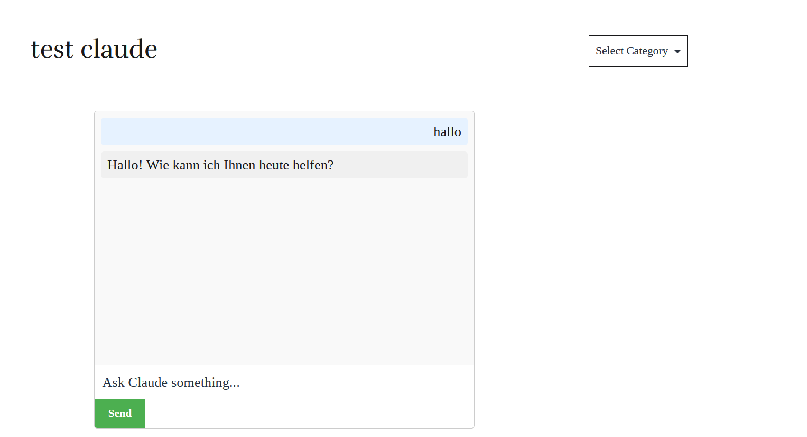
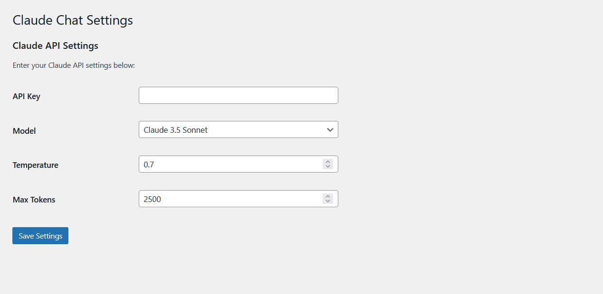

# Claude Chat Interface (WordPress Plugin)


Integrate the Claude AI chat interface into your WordPress website using a simple shortcode.


## Claude Models

### Claude 3 Family:
- **Claude 3 Haiku**: `claude-3-haiku-20240307`
- **Claude 3 Sonnet**: `claude-3-sonnet-20240229`
- **Claude 3 Opus**: `claude-3-opus-20240229`

### Claude 3.5 Family:
- **Claude 3.5 Sonnet**: `claude-3-5-sonnet-20240620`

## Features

- **Easy Integration**: Use a shortcode to seamlessly integrate the Claude AI chat interface into your WordPress site.
- **Admin Settings**: Configure API settings directly from the WordPress admin panel.
- **Customizable Interface**: Modify the chat interface appearance and behavior with ease.
- **Claude API Support**: Full support for Claude API parameters such as temperature, max tokens, and more.
- **AJAX-Based**: Smooth, responsive chat experience powered by AJAX.

## Installation

1. Upload the `claude-chat-interface` folder to the `/wp-content/plugins/` directory.
2. Activate the plugin through the 'Plugins' menu in WordPress.
3. Navigate to 'Settings' > 'Claude Chat' to configure your API settings.

## Usage

To display the chat interface on any page or post, use the shortcode:

```
[claude_chat]
```

## Configuration

Go to 'Settings' > 'Claude Chat' in the WordPress admin panel to configure the following options:

- **API Key**: Enter your Claude API key.
- **Model**: Select the Claude model you wish to use.
- **Temperature**: Adjust the randomness of responses (value between 0.0 and 1.0).
- **Max Tokens**: Set the maximum number of tokens for the response.

## Customization

- **Styling**: Customize the chat interface by editing the `css/claude-chat.css` file.
- **JavaScript**: Add or modify functionality by editing the `js/claude-chat.js` file.

## Requirements

- **WordPress**: Version 5.0 or higher.
- **PHP**: Version 7.0 or higher.
- **Claude API Key**: A valid Claude API key is required.

## Support

For support, feature requests, or to report issues, please open an issue on the GitHub repository.

## License

This plugin is licensed under the DBAD License.

## Copyright

**Volkan Sah**

### Screenshots


