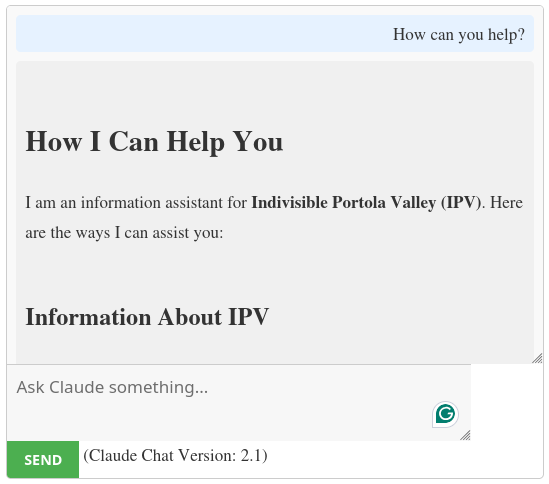
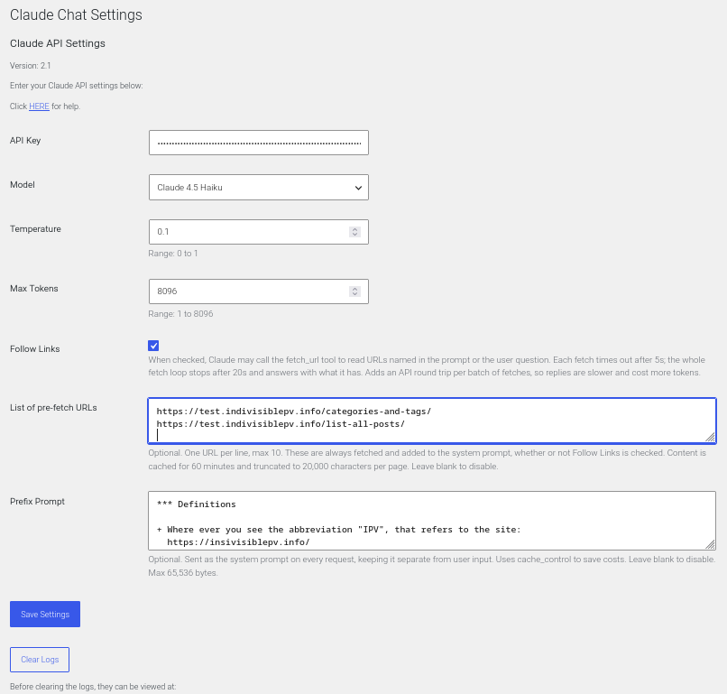

# Claude Chat Interface (WordPress Plugin)


Integrate the Claude AI chat interface into your WordPress website using
a simple shortcode.

## Claude Models

### Claude 3 Family:

-   **Claude 3 Haiku**: `claude-3-haiku-20240307`{.verbatim}
-   **Claude 3 Sonnet**: `claude-3-sonnet-20240229`{.verbatim}
-   **Claude 3 Opus**: `claude-3-opus-20240229`{.verbatim}

### Claude 3.5 Family:

-   **Claude 3.5 Sonnet**: `claude-3-5-sonnet-20240620`{.verbatim}

## Features

-   **Easy Integration**: Use a shortcode to seamlessly integrate the
    Claude AI chat interface into your WordPress site.

-   **Admin Settings**: Configure API settings directly from the
    WordPress admin panel.

-   **Customizable Interface**: Modify the chat interface appearance and
    behavior with ease.

-   **Claude API Support**: Full support for Claude API parameters such
    as temperature, max tokens, and more.

-   **AJAX-Based**: Smooth, responsive chat experience powered by AJAX.

## Install Zip File

1.  Download the latest zip file from:
    [claude-chat-interface](https://moria.whyayh.com/rel/released/software/own/claude-chat-interface/)
2.  At the WP plugin admin page, click on \"Add Plugin\", click on
    \"Upload Plugin\"
3.  Browse to the zip file and select it, open, click on \"Install Now\"
4.  Activate the plugin.
5.  Navigate to \'Settings\' \> \'Claude Chat\' to configure your API
    settings.

## Build/Install

Source: <https://github.com/TurtleEngr/WP-Claude-Interface>

1.  Clone this repo
2.  Or click on the lastest \"tag,\" select the \"Source code\" link to
    download the zip file, then unzip the file.
3.  Run \"make package\" to build and create the zip package.
4.  Install `pkg/claude-chat-interface.zip`{.verbatim} plugin, with the
    above **Install Zip File** directions.

## Usage

To display the chat interface on any page or post, use the shortcode:

``` example
[claude_chat]
```

## Configuration

Go to \'Settings\' \> \'Claude Chat\' in the WordPress admin panel to
configure the following options:

-   **API Key**: Enter your Claude API key.
-   **Model**: Select the Claude model you wish to use.
-   **Temperature**: Adjust the randomness of responses (value between
    0.0 and 1.0).
-   **Max Tokens**: Set the maximum number of tokens for the response.
-   **Follow Links**: Checkbox. If checked URLs in the prompts will be
    followed.
-   **List of pre-fetch URLs**: One URL per line. Each URL will be read
    and added to the prompts.
-   **Prefix Prompt**: Define a prompt that will be put before the
    user\'s prompt.
-   **Save Setting** button: Save the current settings.
-   **Clear Logs** button: the chat and error logs will be cleared
-   Links below Clear Logs are links to the log files that can be
    downloaded.

## Customization

These internal constants can be changed. The defaults values are shown
here. Also, some of these values will be shown in the Claude Chat
Settings admin form.

-   **cgClaudeChatFetchTimeOut**: 5sec for each URL fetch

-   **cgClaudeChatResponseBudget**: 20sec for the whole response

-   **cgClaudeChatPreFetchTtl**: 3600 sec (1 hour)

-   **cgClaudeChatMaxPreFetchUrls**: 10

    -   Pre-fetch list limits. Content is cached in a transient for this
        many seconds, keyed by a hash of the URL list.

-   **cgClaudeChatMaxFetchBytes**: 256 KB

-   **cgClaudeChatMaxFetchChars**: 20 KB

    -   The byte cap protects PHP memory; the character cap protects the
        token budget --- a single large page can otherwise crowd out the
        Prefix Prompt and the user\'s actual question. \*/

-   **cgClaudeChatMaxToolRounds**: 5

    -   Max number of send/tool~result~ round trips. The response budget
        is the primary stop condition; this is a backstop so a model
        that keeps asking for cheap, fast fetches cannot loop
        indefinitely inside the budget.

-   **cgClaudeChatMaxResponseBytes**: 4 MB

-   **cgClaudeChatMaxLogDumpChars**: 4 KB

-   **cgClaudeChatMaxPrefixPrompt**: 65 KB

-   **Styling**: Customize the chat interface by editing the
    `css/claude-chat.css`{.verbatim} file.

-   **JavaScript**: Add or modify functionality by editing the
    `js/claude-chat.js`{.verbatim} file.

## Enhancements

### Added: Prefix Prompt

Registered in fClaudeChatRegisterSettings() with sanitize~textareafield~
as its sanitize callback (multi-line safe).

Added at the bottom of the settings form via
`fClaudeChatSettingsInit().`{.verbatim} It uses
`fClaudeChatTextareaFieldCallback()`{.verbatim} that renders a
\<textarea\> (6 rows × 60 cols) with a description explaining the
caching behaviour. Leaving it blank disables the feature entirely.

**prefix + cache~control~** - `fClaudeChatApiRequest()`{.verbatim}

When a prefix is saved, the user message is sent as a two-block content
array instead of a plain string.

The cache~control~: ephemeral block tells Anthropic\'s API to cache the
prefix across repeated requests --- reducing latency and token cost for
long system-style prompts. The anthropic-beta: prompt-caching-2024-07-31
header is added automatically to enable this feature.

**response cleanup** - `claude_chat_strip_prefix()`{.verbatim}

After the API reply is received, this helper checks (case-insensitively)
whether the response begins with the prefix text and strips it if so.
Claude won\'t normally echo the prefix back, but this guards against
edge cases where it does.

**`claude.php`{.verbatim}**: Register 3 new options
(`addon_prompt_enabled`{.verbatim},
addon~promptlabel~=,=addon~prompttext~=), add a single settings field
with a custom callback rendering all three controls, update the
shortcode to conditionally render the user-form checkbox, and pass the
addon prompt text to JS via=wp~localizescript~\`.

**`js/claude-chat.js`{.verbatim}**: Before sending, check if the addon
checkbox exists and is checked --- if so, append the addon prompt text
(from the localized data) to the message.

**`css/claude-chat.css`{.verbatim}**: Add a small style for the addon
checkbox row in the user form.

### Minor improvements

Added newer models to `cgClaudeChatModels`{.verbatim} (Claude 3.5 Haiku,
Claude 3.5 Sonnet Oct 2024, Claude 3.7 Sonnet).

Fixed temperature to only be sent when it\'s actually set (previously 0
would be silently dropped).

Bumped Max Tokens ceiling to 8096 to match modern model limits.

### js or css changes

js/claude-chat.js --- The JavaScript only handles the chat UI: capturing
the user\'s input, sending it to admin-ajax.php via AJAX, and displaying
the response. None of that flow changed. The prefix prompt is added (and
stripped) entirely on the PHP/server side, invisibly to the JS layer.

css/claude-chat.css --- The new Prefix Prompt field in the admin
settings form uses standard WordPress admin classes (large-text, code,
description) that are already styled by WordPress core. No custom CSS is
needed.

## Requirements

-   **WordPress**: Version 5.0 or higher. (tested with 6.9.4)
-   **PHP**: Version 7.0 or higher. (tested with 8.3.30)
-   **Claude API Key**: A valid Claude API key is required.

### Screenshots

1.  Public View

    

2.  Settings

    

    -   API Key - Put your Claude API key here
    -   Model - Pick the model you want
    -   Temperature - Range: 0 to 1
    -   Max Tokens - Range: 1 to 8096
    -   Follow Links - checkbox
        -   When checked, Claude may call the fetch~url~ tool to read
            URLs named in the prompt or the user question. Each fetch
            times out after 5s; the whole fetch loop stops after 20s and
            answers with what it has. Adds an API round trip per batch
            of fetches, so replies are slower and cost more tokens.
    -   List of pre-fetch URLs - textbox
        -   Optional. One URL per line, max 10. These are always fetched
            and added to the system prompt, whether or not Follow Links
            is checked. Content is cached for 60 minutes and truncated
            to 20,000 characters per page. Leave blank to disable.
    -   Prefix Prompt - textbox
        -   Optional. Sent as the system prompt on every request,
            keeping it separate from user input. Uses cache~control~ to
            save costs. Leave blank to disable. Max 65,536 bytes.
    -   Save Settings - Save any changes.
    -   Clear Logs - This button will clear the user and error logs.
        -   Before clearing the logs, they can be viewed at:
        -   <https://WP-HOME/wp-content/uploads/claude/claude_log.org>
        -   <https://WP-HOME/wp-content/uploads/claude/claude.log>

## Support

For support, feature requests, or to report issues, please open an issue
on the GitHub repository.

## License

This plugin is licensed under the [DBAD
License](https://dbad-license.org/)

## Copyright

**Volkan Sah**

## Note on upsream repository

The repository
\[(VolkanSah/WP-Claude-Interface)\]\[<https://github.com/VolkanSah/WP-Claude-Interface>\]
is archived. Most people just want a ready-made product and don\'t want
to learn from boilerplates --- that\'s fine, but it\'s not what this was
built for.

If you need a real AI client for WordPress with full power behind it,
check out [WP AI Hub](https://github.com/VolkanSah/WP-AI-HUB) --- a thin
client for [Multi-LLM API
Gateway](https://github.com/VolkanSah/Multi-LLM-API-Gateway).

Why? Because with one hub on HuggingFace Spaces you can pull Claude via
API into WordPress, route DeepSeek through OpenRouter, run Flux or Veo 3
for image/video generation --- all at the same time, all through one
connection. Not 20 different plugins to maintain, no annoying premium
limits per plugin, no bloat. Just one hub, all your models, one
WordPress client.

Deploy your own hub, connect it via WP AI Hub --- and actually own your
AI stack.
